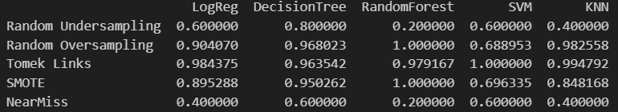

# **Credit Card Fraud Detection using Sampling Techniques and Machine Learning Models** 

## Overview

This project aims to explore various sampling techniques to handle class imbalance in a dataset and evaluate their performance with different machine learning models. The dataset used in this project is the Credit Card Fraud Detection dataset, which is originally imbalanced. The goal is to apply five sampling techniques to balance the dataset and use five machine learning models to evaluate their performance.

## Dataset

The dataset used in this project is available for download from the following link:
https://github.com/AnjulaMehto/Sampling_Assignment/blob/f0c491556cded07517283c75e603bccb70112c26/Creditcard_data.csv 
Credit Card Data CSV

## Data Description

Class: The target variable, where 1 represents a fraudulent transaction, and 0 represents a non-fraudulent transaction.

V1 to V28: Various unknown features representing different aspects of the transaction.

## Objective

Download and load the dataset.
Balance the dataset using different sampling techniques.
Apply five sampling techniques and evaluate them using five machine learning models.
Compare the performance of each sampling technique with each machine learning model to determine the best combination for detecting credit card fraud.

## Sampling Techniques

Random Undersampler : Randomly reduces the majority class to balance the dataset.

Random Oversampler : Randomly increases the minority class by replicating examples.

Tomek Links Sampling : Removes instances from the majority class that are the nearest neighbors of minority class examples.

SMOTE Sampling : Synthetic Minority Over-sampling Technique (SMOTE) generates synthetic examples in the feature space.

NearMiss Sampling : Selects examples of the majority class that are closest to the minority class.

## Machine Learning Models

Logistic Regression 

Decision Tree 

Random Forest 

Support Vector Machine 

K-Nearest Neighbors 

Each model is trained and tested with the five sampling techniques, and performance is evaluated using accuracy.

## After evaluating the performance of various sampling techniques combined with different machine learning models, the results revealed that RandomForestClassifier along with oversampler sampling method had the most accuracy of 0.997817
